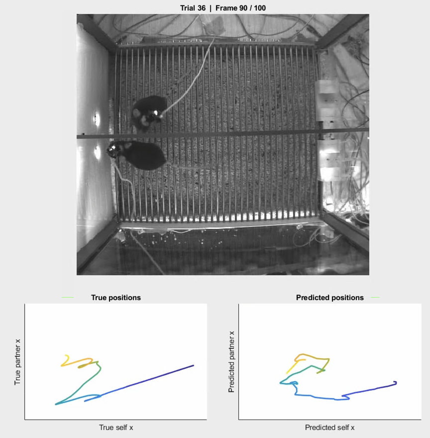
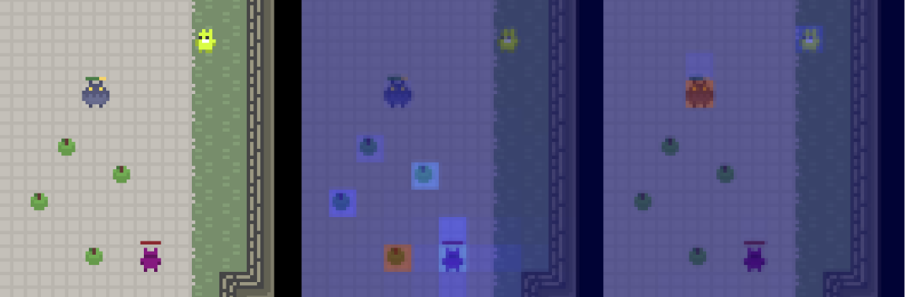

## Neural Principles of Social Representation for Robust Multi-agent AI

This project bridges computational neuroscience and Multi-Agent Reinforcement Learning (MARL). By uncovering how the brain represents social information (self vs. partner manifolds), we introduce a brain-inspired two-head attention architecture that enhances social coordination and interpretability in artificial agents.

## Part I: Neural Principles (/brain_decoder_analysis)
Our biological findings suggest that neurons in the prefrontal cortex represent self and others-related information in two distinct geometric manifolds. Linear regression models trained to predict both self and partner's movement trajectories recovered social dynamics between the two animals.   
We verified results in both cooperative interactions and competitive interactions.   

**Usage**:  
Demostration script: /brain_decoder_analysis/demo.mlx  
Demo video:/brain_decoder_analysis/coop_with_traces3.mp4  

## Part 2: Brain-Inspired Multi-Agent AI
Based on the neural findings, we replaced standard CNN encoders with a Two-Head Attention Architecture that enforces a structural separation between:

**Head 1 (Environmental/Self)**: Focuses on static arena features, rewards (gold/apples), and walls.   
**Head 2 (Social/Partner)**: Dedicated representational capacity for partner movement and egocentric tracking.

## Environments 
We utilize the [Meltingpot](https://github.com/deepmind/meltingpot/) suite implemented with the IMPALA algorithm for parallelism. This impenmentation is developed on top of [marl-jax](https://github.com/kinalmehta/marl-jax).

**Cooperative interactions: Coop-Mining**: Agents must coordinate to mine gold and can individually mine irons.  
**Competitive interactions: Predator-Prey**: Predators must track prey egocentrically while prey attends to environmental resources.

**Installation**:
- [Installation Instructions](installation.md)
- [Environment Details](environments.md)

**Two-head attention**:
Details of the brain-inspired agent network: /marl/agents/impala/networks.py  

